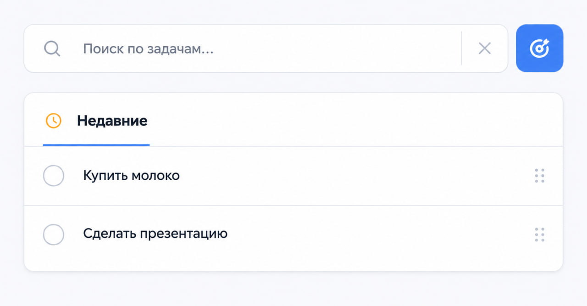
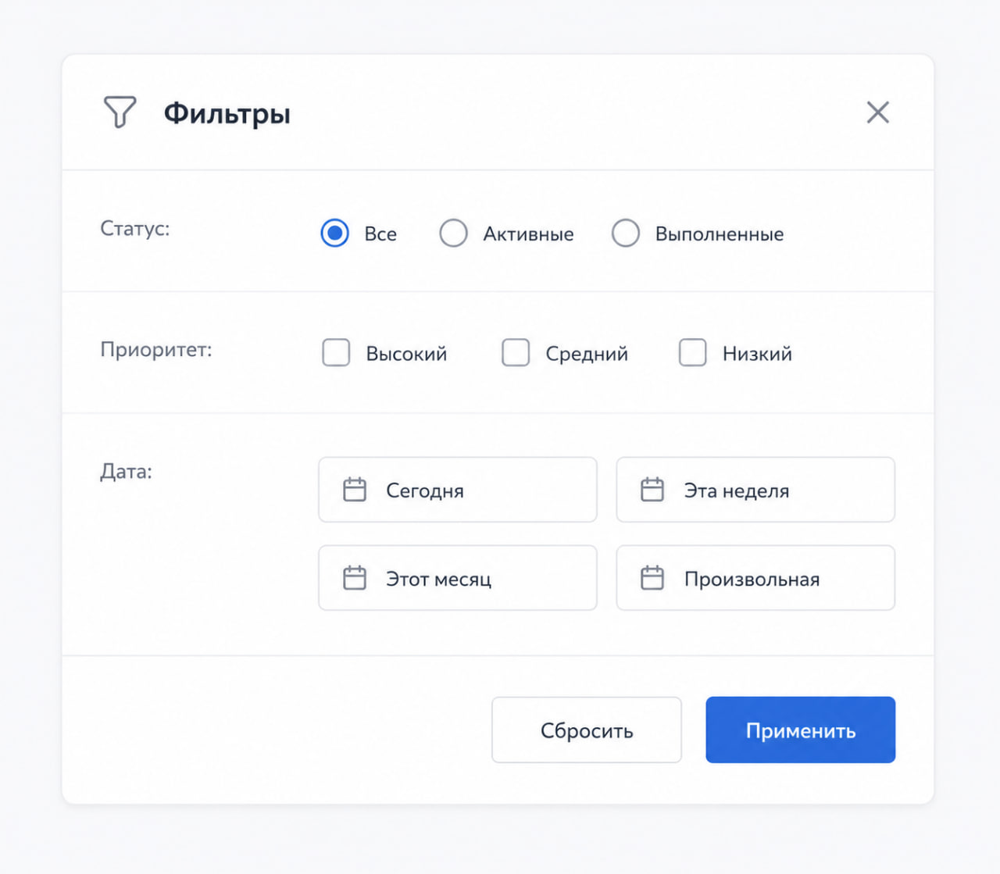
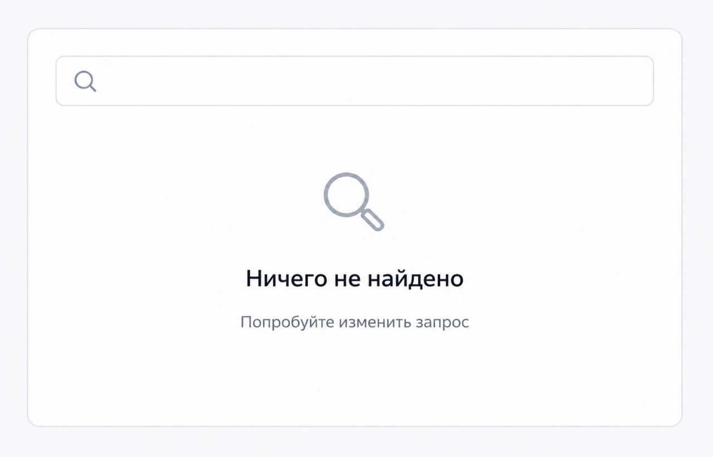

# Этап 10. Внедрение дополнительной логики (Поиск и Уведомления)
## Правила фильтрации и сортировки (СА)
### Спецификация поиска и фильтрации:
| Параметр | Значения | Поведение |
| --- | --- | --- |
| filter | all, active, done | Фильтр по статусу выполнения |
| search | строка (min 1 символ, max 100) | Поиск по полю title (частичное совпадение, без учёта регистра) |
| sort | due_date, created_at, title, priority | Сортировка: дата дедлайна → по возрастанию (null в конце), дата создания → DESC, заголовок → ASC |
| priority (опционально) | high, medium, low | Фильтр по приоритету (требует доработки БД) |

### Приоритет параметров:
1.	Сначала применяется search

2.	Затем filter

3.	Затем sort

### Примеры запросов:
•	GET /tasks?filter=active&search=презентация → активные задачи со словом "презентация"

•	GET /tasks?sort=due_date&filter=done → выполненные задачи, отсортированные по дедлайну
---
## Дизайн элементов поиска (UX)
### Макет поисковой строки:


### Расширенные фильтры (модальное окно):



### Пустое состояние поиска:


---
## Полнотекстовый поиск и WebSockets (BE)
### 1. Полнотекстовый поиск (SQLite):
``` python
@app.get("/api/tasks")
def get_tasks(
    filter: str = "all",
    search: Optional[str] = None,
    sort: str = "due_date",
    user_id: int = Depends(get_current_user)
):
    conn = sqlite3.connect("todo.db")
    cursor = conn.cursor()

    query = "SELECT id, title, description, due_date, is_done FROM tasks WHERE user_id = ?"
    params = [user_id]

    # Поиск с LIKE (можно заменить на FTS5 для больших проектов)
    if search and len(search) >= 2:
        query += " AND title LIKE ?"
        params.append(f"%{search}%")

    if filter == "active":
        query += " AND is_done = 0"
    elif filter == "done":
        query += " AND is_done = 1"

    # Сортировка
    sort_map = {
        "due_date": "due_date ASC NULLS LAST",
        "created_at": "created_at DESC",
        "title": "title ASC"
    }
    query += f" ORDER BY {sort_map.get(sort, 'due_date ASC')}"

    cursor.execute(query, params)
    rows = cursor.fetchall()
    conn.close()

    return [{"id": r[0], "title": r[1], "due_date": r[3], "is_done": r[4]} for r in rows]
```
### 2. WebSockets для уведомлений в реальном времени:
``` python
from fastapi import WebSocket, WebSocketDisconnect
from typing import List

class ConnectionManager:
    def __init__(self):
        self.active_connections: List[WebSocket] = []

    async def connect(self, websocket: WebSocket):
        await websocket.accept()
        self.active_connections.append(websocket)

    def disconnect(self, websocket: WebSocket):
        self.active_connections.remove(websocket)

    async def broadcast(self, message: str):
        for connection in self.active_connections:
            await connection.send_text(message)

manager = ConnectionManager()

@app.websocket("/ws/{user_id}")
async def websocket_endpoint(websocket: WebSocket, user_id: int):
    await manager.connect(websocket)
    try:
        while True:
            data = await websocket.receive_text()
            # Здесь можно обрабатывать входящие сообщения
            await manager.broadcast(f"User {user_id}: {data}")
    except WebSocketDisconnect:
        manager.disconnect(websocket)

# При создании задачи отправляем уведомление
@app.post("/api/tasks", status_code=201)
async def create_task(task: TaskCreate, user_id: int = Depends(get_current_user)):
    # ... создание задачи ...

    # Отправляем уведомление всем подключённым
    await manager.broadcast(f"Новая задача: {task.title}")

    return {"id": task_id, "title": task.title}
```
### 3. Клиентская часть (WebSocket):
``` javascript
// Подключение к WebSocket
const ws = new WebSocket(`ws://localhost:8000/ws/${userId}`);

ws.onmessage = (event) => {
    // Показываем уведомление
    showNotification(event.data);

    // Обновляем список задач
    refreshTaskList();
};

function showNotification(message) {
    const toast = document.createElement('div');
    toast.className = 'toast';
    toast.textContent = message;
    document.body.appendChild(toast);
    setTimeout(() => toast.remove(), 3000);
}
```
---
## Настройка очередей или сокетов (TL)
### Для уведомлений выбрана архитектура WebSockets (проще для семестра).
### Альтернатива для масштабирования (если надо): Redis + Celery
### Конфигурация WebSocket в production:
``` python
# main.py
from fastapi import FastAPI
from fastapi.middleware.cors import CORSMiddleware

app = FastAPI()

@app.on_event("startup")
async def startup():
    print("WebSocket server started")

@app.on_event("shutdown")
async def shutdown():
    await manager.close_all_connections()
```
### Docker-конфигурация (для деплоя):
``` dockerfile
FROM python:3.11
WORKDIR /app
COPY requirements.txt .
RUN pip install -r requirements.txt
COPY . .
CMD ["uvicorn", "main:app", "--host", "0.0.0.0", "--port", "8000"]
```
