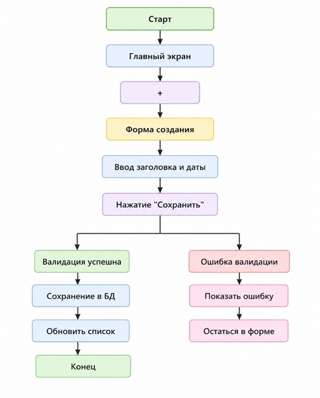
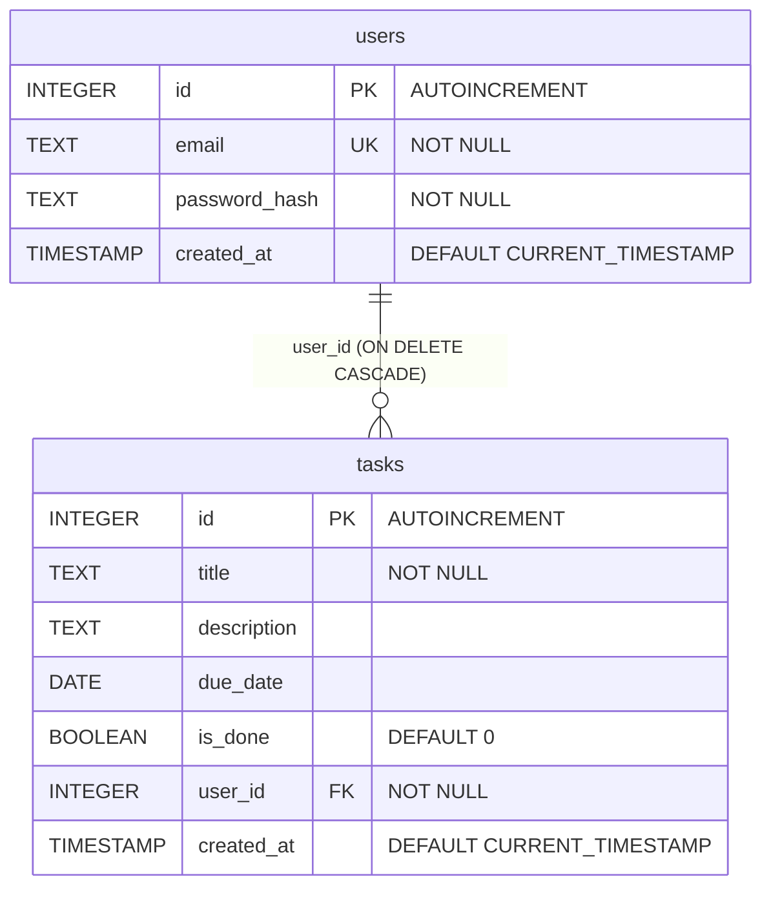

## Этап 3. Проектирование архитектуры и базы данных

### Детализация сценария «Создание задачи» (СА)

**Scenario:** Пользователь создаёт новую задачу

| Шаг | Действие | Система | Данные |
| --- | --- | --- | --- |
| 1   | Нажимает кнопку «+» | Открывает форму создания | —   |
| 2   | Вводит заголовок (обязательно) | Валидирует: не пустой | title |
| 3   | Вводит дату (опционально) | Проверяет формат (ГГГГ-ММ-ДД) | due_date |
| 4   | Нажимает «Сохранить» | Отправляет POST-запрос | {title, due_date} |
| 5   | —   | Проверяет JWT-токен | user_id из токена |
| 6   | —   | Сохраняет задачу в БД | INSERT INTO tasks... |
| 7   | —   | Возвращает созданную задачу с ID | {id, title, due_date, is_done: false} |
| 8   | Получает ответ | Добавляет задачу в список на UI | —   |

**Альтернативные потоки:**

- Заголовок пуст → ошибка 400, задача не создаётся
- Невалидная дата → ошибка 400
- Нет токена или истёк → ошибка 401, перенаправление на логин

### User Flow (блок-схема)



### ER-диаграмма базы данных

Схема базы данных (SQLite):

```sql
CREATE TABLE users (
    id INTEGER PRIMARY KEY AUTOINCREMENT,
    email TEXT UNIQUE NOT NULL,
    password_hash TEXT NOT NULL,
    created_at TIMESTAMP DEFAULT CURRENT_TIMESTAMP
);

CREATE TABLE tasks (
    id INTEGER PRIMARY KEY AUTOINCREMENT,
    title TEXT NOT NULL,
    description TEXT,
    due_date DATE,
    is_done BOOLEAN DEFAULT 0,
    user_id INTEGER NOT NULL,
    created_at TIMESTAMP DEFAULT CURRENT_TIMESTAMP,
    FOREIGN KEY (user_id) REFERENCES users(id) ON DELETE CASCADE
);
```

Графическое представление в нотации Crow's Foot:


### Основные эндпоинты API (BE)

| Метод | Эндпоинт | Тело запроса | Ответ | Описание |
| --- | --- | --- | --- | --- |
| POST | /api/register | {email, password} | {user_id, email} | Регистрация |
| POST | /api/login | {email, password} | {access_token, token_type} | Вход (JWT) |
| GET | /api/tasks | —   | \[{task}, ...\] | Получить все задачи пользователя |
| POST | /api/tasks | {title, due_date?} | {task} | Создать задачу |
| PUT | /api/tasks/{id} | {title?, due_date?, is_done?} | {task} | Обновить задачу |
| DELETE | /api/tasks/{id} | —   | {message} | Удалить задачу |

**Заголовок для защищённых запросов:**

text

Authorization: Bearer &lt;jwt_token&gt;

### Нормализация БД и технологический стек (TL)

**Нормализация:** ✅ 3-я нормальная форма

- Нет повторяющихся групп
- Все неключевые атрибуты зависят от первичного ключа
- Нет транзитивных зависимостей

**Cтек:**

| Компонент | Выбор | Причина |
| --- | --- | --- |
| Backend | Python + FastAPI | Быстрый, асинхронный, лёгкий для старта |
| Database | SQLite (dev) / PostgreSQL (prod) | SQLite — без настройки, Postgres — для деплоя |
| Auth | JWT (python-jose) | Стандарт, без сессий на сервере |
| Frontend | React + Axios (или vanilla JS) | По уровню команды |
| Dependencies | pip + venv | Классика Python |
| Deployment | Railway / Render | Бесплатный хостинг с CI |
