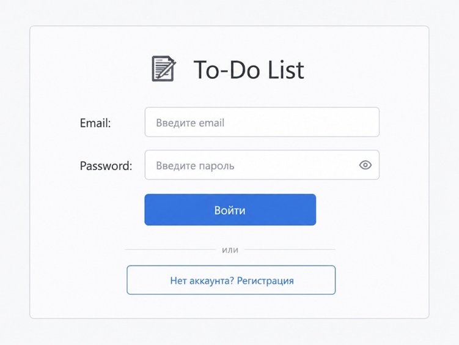
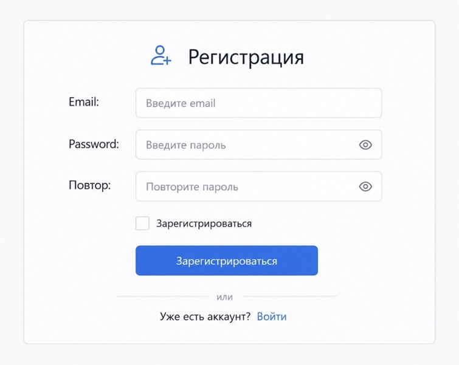
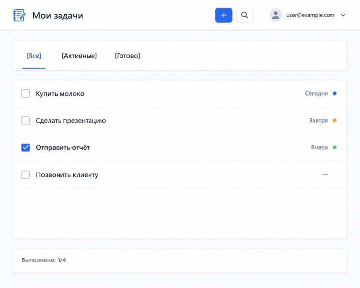
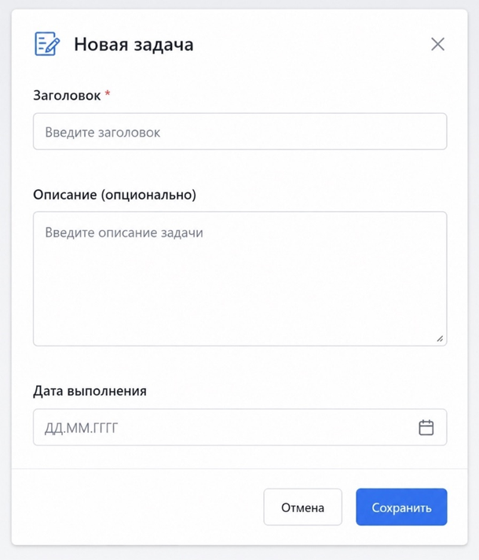

## Этап 4. Прототипирование интерфейсов (Wireframes)
### Структура экранов (UX)

**1.Экран входа**

**2. Экран регистрации**

**3. Главный экран (список задач)**

**4.Форма создания/редактирования задачи**

### Проверка бизнес-шагов (СА)

Все шаги из Use Case отражены:

•	Вход/регистрация ✅

•	Просмотр списка задач ✅

•	Создание задачи ✅

•	Отметка о выполнении (чекбокс) ✅

•	Редактирование (нажать на задачу → форма) ✅

•	Удаление (иконка 🗑️ у задачи) ✅

•	Фильтрация (табы) ✅

•	Поиск (🔍) ✅

### Техническая реализуемость (BE)
Все данные в прототипе можно отдать через API:

•	Список задач → GET /tasks

•	Чекбокс → PUT /tasks/{id} {is_done: true}

•	Форма → POST /tasks

•	Поиск → GET /tasks?search=...
