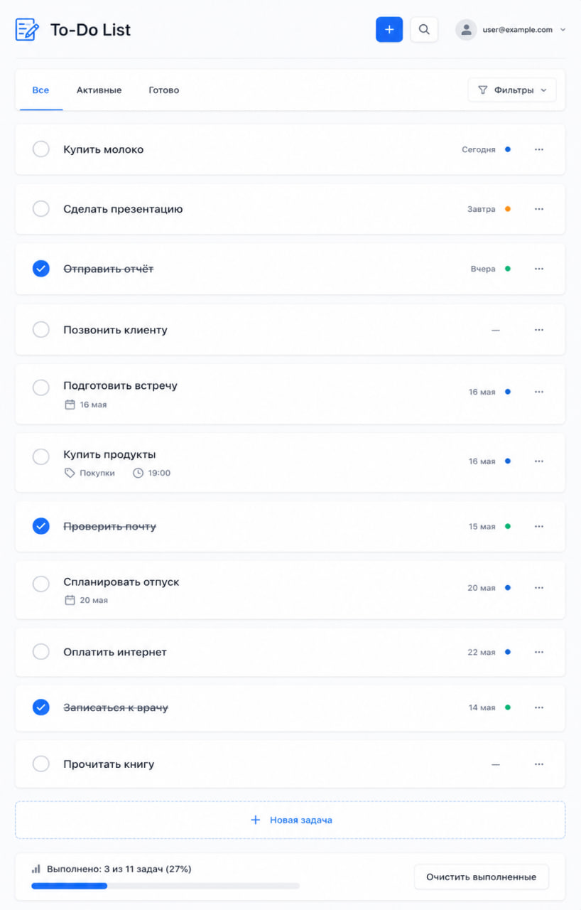

# Этап 7. Разработка главного экрана и навигации
## Приоритеты виджетов на главной (СА)
### Приоритет (от самого важного):
| Приоритет | Элемент | Описание |
| --- | --- | --- |
| P0 (критично) | Список задач | Основная сущность, без него нет смысла |
| P0 (критично) | Кнопка создания задачи (+) | Быстрое добавление |
| P1 (важно) | Фильтры (Все/Активные/Выполненные) | Организация списка |
| P1 (важно) | Чекбокс выполнения | Основное действие |
| P2 (хорошо бы) | Счётчик выполненных задач | Мотивация |
| P2 (хорошо бы) | Поиск | Удобство при большом списке |
| P3 (опционально) | Сортировка (по дате, по приоритету) | Расширенный функционал |
---
## Дизайн главной страницы (UX)
### Полный макет главного экрана (описание для Figma):


### Состояния элементов:
•	Обычная задача: белый фон, граница, чекбокс пустой

•	Выполненная задача: фон светлее, текст зачёркнут, чекбокс с галочкой

•	Просроченная задача: красная иконка ⚠️, подсветка даты

•	Hover над задачей: тень, курсор-указатель

•	Активный фильтр: синий фон, белый текст

•	Пустое состояние: иконка 📭 и текст "Нет задач. Создайте первую!"

## Эндпоинты для выдачи данных на главную (BE)
### Расширение API для главной страницы:
```python
from fastapi import FastAPI, Depends, Query
from typing import Optional, List
from pydantic import BaseModel
from datetime import date, datetime

app = FastAPI()

# Модели
class TaskResponse(BaseModel):
    id: int
    title: str
    description: Optional[str] = None
    due_date: Optional[date] = None
    is_done: bool
    created_at: datetime
    is_overdue: bool = False  # вычисляемое поле

# Новые эндпоинты для главной
@app.get("/api/tasks", response_model=List[TaskResponse])
def get_tasks(
    filter: Optional[str] = Query("all", regex="^(all|active|done)$"),
    search: Optional[str] = None,
    sort: Optional[str] = Query("due_date", regex="^(due_date|created_at|title)$"),
    user_id: int = Depends(get_current_user)
):
    conn = sqlite3.connect("todo.db")
    cursor = conn.cursor()

    # Базовый запрос
    query = "SELECT id, title, description, due_date, is_done, created_at FROM tasks WHERE user_id = ?"
    params = [user_id]

    # Фильтрация
    if filter == "active":
        query += " AND is_done = 0"
    elif filter == "done":
        query += " AND is_done = 1"

    # Поиск
    if search:
        query += " AND title LIKE ?"
        params.append(f"%{search}%")

    # Сортировка
    if sort == "due_date":
        query += " ORDER BY due_date ASC NULLS LAST"
    elif sort == "created_at":
        query += " ORDER BY created_at DESC"
    elif sort == "title":
        query += " ORDER BY title ASC"

    cursor.execute(query, params)
    rows = cursor.fetchall()
    conn.close()

    # Формируем ответ с вычислением просрочки
    tasks = []
    today = date.today()
    for row in rows:
        is_overdue = False
        if row[3] and not row[4]:  # если есть due_date и задача не выполнена
            is_overdue = row[3] < today

        tasks.append(TaskResponse(
            id=row[0],
            title=row[1],
            description=row[2],
            due_date=row[3],
            is_done=bool(row[4]),
            created_at=datetime.fromisoformat(row[5]),
            is_overdue=is_overdue
        ))

    return tasks

@app.get("/api/tasks/stats")
def get_stats(user_id: int = Depends(get_current_user)):
    conn = sqlite3.connect("todo.db")
    cursor = conn.cursor()

    cursor.execute(
        "SELECT COUNT(*), SUM(CASE WHEN is_done = 1 THEN 1 ELSE 0 END) FROM tasks WHERE user_id = ?",
        (user_id,)
    )
    total, done = cursor.fetchone()
    conn.close()

    total = total or 0
    done = done or 0
    percent = round(done / total * 100) if total > 0 else 0

    return {
        "total": total,
        "done": done,
        "active": total - done,
        "percent": percent
    }
```
---
## Задача на вёрстку и помощь с деплоем (TL)
### Задача в Trello:
``` text
Название: Вёрстка главного экрана
Описание:
- Сверстать главный экран по макетам из Figma
- Адаптивная вёрстка (мобильная + десктоп)
- Подключить API (GET /tasks, GET /tasks/stats)
- Реализовать переключение фильтров без перезагрузки
Оценка: 8 часов
Исполнитель: Frontend-разработчик
```
## Деплой dev-версии (для тестирования):
``` bash
# На сервере (Railway)
railway login
railway init
railway up

# Переменные окружения
SECRET_KEY=production-secret-key
DATABASE_URL=postgresql://...
```
